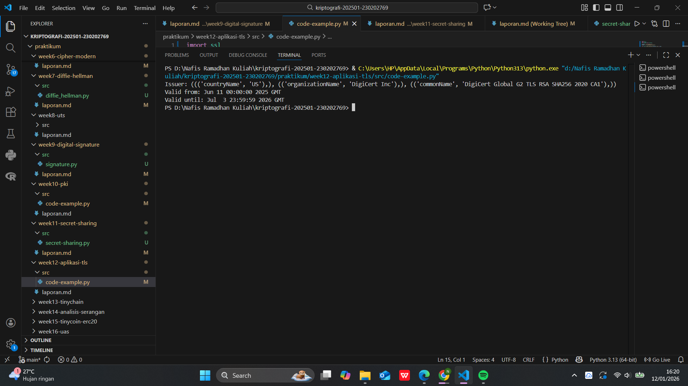

# Laporan Praktikum Kriptografi
Minggu ke-: 12  
Topik: Aplikasi TLS & E-commerce  
Nama: Nafis Ramadhan Khoeru Jati  
NIM: 230202769  
Kelas: 5IKRB  

---

## 1. Tujuan
Tujuan dari praktikum ini adalah untuk memahami penerapan protokol SSL/TLS dalam komunikasi digital, khususnya pada layanan email dan platform e-commerce. Mahasiswa diharapkan mampu menganalisis fungsi sertifikat digital, mekanisme enkripsi data, serta mengevaluasi peran kriptografi dalam menjaga keamanan, privasi, dan kepercayaan pengguna.

---

## 2. Dasar Teori
Transport Layer Security (TLS) merupakan protokol keamanan yang digunakan untuk melindungi komunikasi data pada jaringan komputer. TLS bekerja dengan menyediakan enkripsi, autentikasi, dan integritas data sehingga informasi yang dikirimkan tidak dapat dibaca atau dimodifikasi oleh pihak yang tidak berwenang.

Pada implementasinya, TLS menggunakan sertifikat digital yang dikeluarkan oleh Certificate Authority (CA) untuk memverifikasi identitas server. Sertifikat ini memuat informasi seperti nama domain, masa berlaku, dan algoritma kriptografi yang digunakan. Dengan adanya TLS, protokol HTTP berkembang menjadi HTTPS yang lebih aman.

Dalam konteks e-commerce dan email, TLS berperan penting dalam melindungi data sensitif seperti kredensial login, informasi pribadi, dan detail transaksi keuangan. Tanpa mekanisme ini, komunikasi rentan terhadap serangan seperti penyadapan dan Man-in-the-Middle (MitM).

---

## 3. Alat dan Bahan
Browser web (Google Chrome / Mozilla Firefox)
Koneksi internet
Sistem operasi Windows/Linux/macOS
Git dan akun GitHub

---

## 4. Langkah Percobaan
Membuka browser dan mengakses website e-commerce yang menggunakan HTTPS.
Mengklik ikon gembok pada address bar untuk melihat detail sertifikat digital.
Mencatat informasi Certificate Authority (CA), masa berlaku, dan algoritma enkripsi.
Membandingkan akses website HTTPS dengan HTTP (tanpa enkripsi).
Mengamati proses login atau transaksi sebagai contoh penggunaan TLS.
Mengambil screenshot sertifikat digital dan menyimpannya pada folder screenshots/.

---

## 5. Source Code
```python
import ssl
import socket
from datetime import datetime

hostname = "www.tokopedia.com"
context = ssl.create_default_context()

with socket.create_connection((hostname, 443)) as sock:
    with context.wrap_socket(sock, server_hostname=hostname) as ssock:
        cert = ssock.getpeercert()

print("Issuer:", cert['issuer'])
print("Valid from:", cert['notBefore'])
print("Valid until:", cert['notAfter'])

```
)

---

## 6. Hasil dan Pembahasan
Hasil observasi menunjukkan bahwa website e-commerce yang menggunakan HTTPS memiliki sertifikat digital valid yang dikeluarkan oleh CA terpercaya seperti DigiCert atau Let’s Encrypt. Sertifikat tersebut menggunakan algoritma kriptografi modern seperti RSA/ECDSA untuk pertukaran kunci dan AES untuk enkripsi data.

Dengan TLS aktif, data login dan transaksi terenkripsi sehingga tidak dapat dibaca oleh pihak ketiga. Jika TLS tidak digunakan, data dikirim dalam bentuk plaintext dan sangat rentan terhadap penyadapan. Hal ini membuktikan bahwa TLS merupakan komponen krusial dalam menjaga keamanan transaksi online.

Screenshot sertifikat digital:


)

---

## 7. Jawaban Pertanyaan
1. Apa perbedaan utama antara HTTP dan HTTPS?
HTTP tidak menggunakan enkripsi sehingga data dikirim dalam bentuk plaintext, sedangkan HTTPS menggunakan TLS untuk mengenkripsi komunikasi sehingga lebih aman.

2. Mengapa sertifikat digital menjadi penting dalam komunikasi TLS?
Sertifikat digital digunakan untuk memverifikasi identitas server dan membangun kepercayaan antara klien dan server sehingga mencegah serangan pemalsuan identitas.

3. Bagaimana kriptografi mendukung privasi namun menimbulkan tantangan etika?
Kriptografi melindungi privasi pengguna, namun dapat menyulitkan penegakan hukum dan pengawasan sehingga menimbulkan dilema antara keamanan nasional dan hak privasi individu.
---

## 8. Kesimpulan
TLS berperan penting dalam menjaga keamanan dan privasi komunikasi digital, khususnya pada layanan email dan e-commerce. Dengan penerapan enkripsi dan sertifikat digital, risiko kebocoran data dapat diminimalkan. Namun, penggunaan kriptografi juga perlu diimbangi dengan kebijakan etika dan hukum yang tepat.

---

## 9. Daftar Pustaka
-

---

## 10. Commit Log
```
commit abc12345
Author: Nafis Ramadhan Khoeru Jati <nafisramadhankhoerujati@gmail.com>
Date:   2026-01-12

    week12-aplikasi-tls
```
