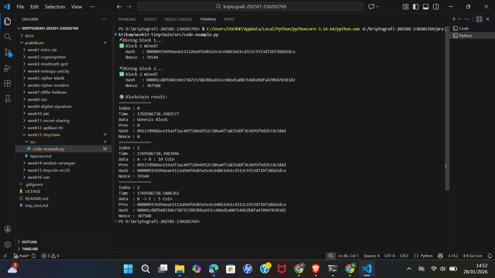

# Laporan Praktikum Kriptografi
Minggu ke-: 13  
Topik: TinyChain – Proof of Work (PoW)  
Nama: Nafis Ramadhan Khoeru Jati  
NIM: 230202769  
Kelas: 5IKRB  

---

## 1. Tujuan
Setelah mengikuti praktikum ini, mahasiswa diharapkan mampu:  
1. Menjelaskan peran **hash function** dalam blockchain.  
2. Melakukan simulasi sederhana **Proof of Work (PoW)**.  
3. Menganalisis keamanan cryptocurrency berbasis kriptografi.

---

## 2. Dasar Teori
Blockchain merupakan struktur data terdistribusi yang terdiri dari rangkaian blok yang saling terhubung menggunakan nilai hash. Setiap blok menyimpan data transaksi, hash blok sebelumnya, timestamp, serta nonce. Keterkaitan hash ini menjamin integritas data karena perubahan pada satu blok akan mengubah hash dan merusak rantai blok berikutnya.

Fungsi hash kriptografi (misalnya SHA-256) berperan penting dalam blockchain karena menghasilkan nilai hash dengan panjang tetap, bersifat deterministik, dan sulit dibalik (one-way). Hash digunakan untuk memastikan integritas data dan sebagai dasar mekanisme konsensus seperti Proof of Work.

Proof of Work (PoW) adalah mekanisme konsensus yang mengharuskan penambang (miner) memecahkan teka-teki komputasi dengan mencari nilai nonce tertentu agar hash blok memenuhi tingkat kesulitan (difficulty) yang ditetapkan. Proses ini membutuhkan waktu dan sumber daya komputasi sehingga mempersulit pihak tidak berwenang untuk memodifikasi data transaksi.

---

## 3. Alat dan Bahan
(- Python 3.11  
- Visual Studio Code / editor lain  
- Git dan akun GitHub  
- Library tambahan (misalnya pycryptodome, jika diperlukan)  )

---

## 4. Langkah Percobaan
1. Membuat struktur folder praktikum/week13-tinychain/ yang berisi folder src, screenshots, dan file laporan.md.
2. Membuat file tinychain.py di dalam folder src/.
3. Menuliskan kode program untuk class Block dan Blockchain sesuai panduan praktikum.
4. Menjalankan program menggunakan perintah python tinychain.py.
5. Mengamati proses mining blok dan mencatat hash yang dihasilkan.
6. Mengambil screenshot hasil eksekusi program dan menyimpannya pada folder screenshots/.

---

## 5. Source Code

```python
import hashlib
import time
class Block:
def __init__(self, index, previous_hash, data, timestamp=None):
self.index = index
self.timestamp = timestamp or time.time()
self.data = data
self.previous_hash = previous_hash
self.nonce = 0
self.hash = self.calculate_hash()
def calculate_hash(self):
value = str(self.index) + str(self.timestamp) + str(self.data) + str(self.previous_hash) + str(self.nonce)
return hashlib.sha256(value.encode()).hexdigest()
def mine_block(self, difficulty):
while self.hash[:difficulty] != "0" * difficulty:
self.nonce += 1
self.hash = self.calculate_hash()
print(f"Block mined: {self.hash}")
class Blockchain:
def __init__(self):
self.chain = [self.create_genesis_block()]
self.difficulty = 4
def create_genesis_block(self):
return Block(0, "0", "Genesis Block")
def get_latest_block(self):
return self.chain[-1]
def add_block(self, new_block):
new_block.previous_hash = self.get_latest_block().hash
new_block.mine_block(self.difficulty)
self.chain.append(new_block)
# Uji coba blockchain
my_chain = Blockchain()
print("Mining block 1...")
my_chain.add_block(Block(1, "", "Transaksi A → B: 10 Coin"))
print("Mining block 2...")
my_chain.add_block(Block(2, "", "Transaksi B → C: 5 Coin"))
```
)

---

## 6. Hasil dan Pembahasan
Hasil eksekusi program menunjukkan bahwa setiap blok berhasil ditambang setelah melalui proses pencarian nonce yang menghasilkan hash dengan awalan nol sesuai tingkat kesulitan (difficulty = 4). Semakin tinggi nilai difficulty, semakin lama waktu yang dibutuhkan untuk menemukan hash yang valid.
Proses mining membuktikan bahwa Proof of Work memerlukan usaha komputasi yang signifikan. Hal ini membuat manipulasi data menjadi tidak efisien karena penyerang harus menambang ulang seluruh blok berikutnya dengan tingkat kesulitan yang sama atau lebih tinggi.

Screenshot hasil mining disimpan pada folder screenshots/ sebagai bukti eksekusi program.



)

---

## 7. Jawaban Pertanyaan
1. Fungsi hash sangat penting dalam blockchain karena menjamin integritas data, menghubungkan setiap blok secara kriptografis, dan membuat perubahan data mudah terdeteksi.
2. Proof of Work mencegah double spending dengan memastikan bahwa setiap transaksi harus divalidasi melalui proses mining yang mahal secara komputasi, sehingga transaksi ganda sulit dilakukan.
3. Kelemahan PoW adalah konsumsi energi yang tinggi dan efisiensi rendah karena membutuhkan sumber daya komputasi besar untuk proses mining.
---

## 8. Kesimpulan
Berdasarkan praktikum yang dilakukan, dapat disimpulkan bahwa fungsi hash dan Proof of Work berperan penting dalam menjaga keamanan dan integritas blockchain. Meskipun efektif dari sisi keamanan, PoW memiliki kelemahan utama pada efisiensi energi.

---

## 9. Daftar Pustaka

---

## 10. Commit Log
(Tuliskan bukti commit Git yang relevan.  
Contoh:
```
commit abc12345
Author: Nama Mahasiswa <email>
Date:   2025-09-20

    week2-cryptosystem: implementasi Caesar Cipher dan laporan )
```
