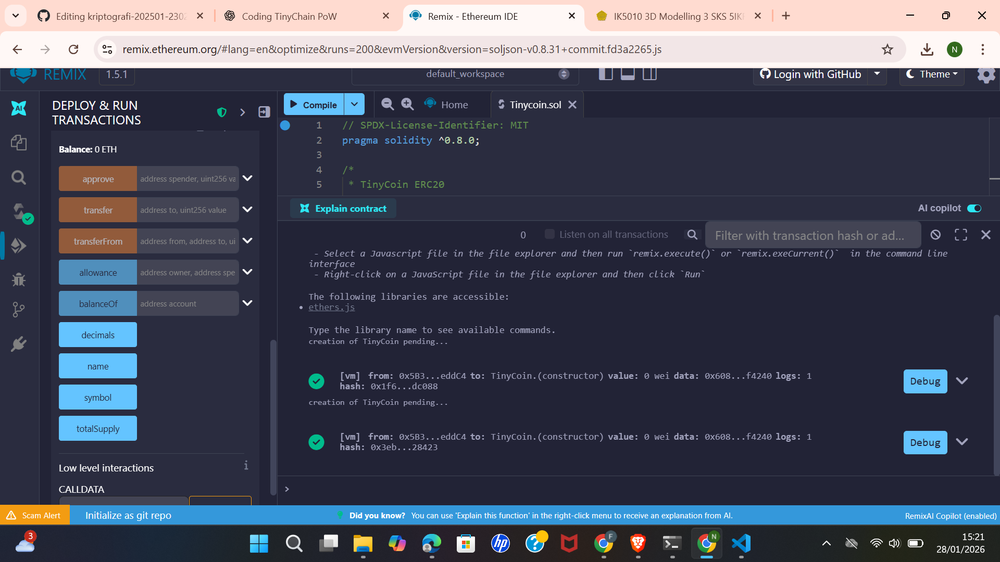

# Laporan Praktikum Kriptografi
Minggu ke-: 15  
Topik: Tinycoin ERC20  
Nama: Nafis Ramadhan Khoeru Jati  
NIM: 230202769  
Kelas: 5IKRB  

---

## 1. Tujuan
1. Mengembangkan proyek sederhana berbasis algoritma kriptografi.  
2. Mendokumentasikan proses implementasi proyek ke dalam repository Git.  
3. Menyusun laporan teknis hasil proyek akhir.

---

## 2. Dasar Teori
ERC20 merupakan standar token pada blockchain Ethereum yang mendefinisikan sekumpulan fungsi dasar seperti `totalSupply`, `balanceOf`, dan `transfer`. Standar ini memungkinkan token dapat digunakan secara interoperable di berbagai aplikasi terdesentralisasi (dApps), wallet, dan exchange.Smart contract adalah program yang dijalankan di blockchain dan bersifat immutable setelah dideploy. Oleh karena itu, pengembangan smart contract harus memperhatikan aspek keamanan seperti validasi input, pengelolaan hak akses, serta pencegahan kerentanan umum. Pada praktikum ini, kontrak ERC20 dibuat menggunakan library OpenZeppelin yang telah diaudit sehingga dapat mengurangi risiko kesalahan implementasi kriptografi dan keamanan.

---

## 3. Alat dan Bahan
- Remix IDE  
- Browser (Google Chrome / Firefox)  
- Solidity Compiler versi ^0.8.0  
- Library OpenZeppelin ERC20  
- Git dan GitHub  

---

## 4. Langkah Percobaan
1. Membuat folder `praktikum/week15-tinycoin-erc20/`.
2. Membuat file `contracts/TinyCoin.sol`.
3. Menuliskan smart contract ERC20 menggunakan library OpenZeppelin.
4. Melakukan kompilasi kontrak menggunakan Remix IDE.
5. Melakukan deployment kontrak ke JavaScript VM atau testnet Ethereum.
6. Menguji fungsi `balanceOf` dan `transfer`.
7. Mendokumentasikan hasil pengujian dalam laporan.

---

## 5. Source Code
(Salin kode program utama yang dibuat atau dimodifikasi.  
Gunakan blok kode:

```solidity
// SPDX-License-Identifier: MIT
pragma solidity ^0.8.0;

/*
 * TinyCoin ERC20
 * Week 15 - Proyek Kelompok
 * Implementasi token ERC20 sederhana
 */

import "@openzeppelin/contracts/token/ERC20/ERC20.sol";

contract TinyCoin is ERC20 {

    // Constructor dijalankan sekali saat kontrak di-deploy
    constructor(uint256 initialSupply) ERC20("TinyCoin", "TNC") {
        // Mint token awal ke alamat deployer
        _mint(msg.sender, initialSupply);
    }
}

```
)

---

## 6. Hasil dan Pembahasan
Kontrak TinyCoin berhasil dikompilasi dan dideploy menggunakan Remix IDE. Setelah deployment, saldo awal token diberikan kepada alamat deployer sesuai dengan nilai initialSupply.

Pengujian fungsi transfer menunjukkan bahwa token dapat dipindahkan antar alamat dengan benar dan nilai totalSupply tetap konsisten. Hal ini membuktikan bahwa implementasi ERC20 berjalan sesuai standar.

Screenshot hasil deployment dan transaksi token:




---

## 7. Jawaban Pertanyaan
1. ERC20 berfungsi sebagai standar token yang memungkinkan interoperabilitas antar aplikasi, wallet, dan exchange dalam ekosistem Ethereum.
2. Fungsi transfer akan mengurangi saldo pengirim dan menambahkan saldo penerima sesuai jumlah token yang ditransfer, selama saldo pengirim mencukupi.
3. Risiko utama meliputi bug kode dan kerentanan keamanan. Mitigasinya adalah menggunakan library terpercaya seperti OpenZeppelin, melakukan audit kode, dan menggunakan versi Solidity terbaru.
   
---

## 8. Kesimpulan
Praktikum ini berhasil mengimplementasikan smart contract ERC20 TinyCoin dengan fungsionalitas dasar yang berjalan sesuai standar. Dokumentasi dan pengujian menunjukkan bahwa penggunaan library yang telah diaudit dapat meningkatkan keamanan dan keandalan smart contract.

---

## 9. Daftar Pustaka
-

---

## 10. Commit Log
```
Author: Nafis Ramadhan Khoeru Jati <nafisramadhankhoerujati@gmail.com>
Date:   2026-01-128

    week15-tinycoin-erc20
```
