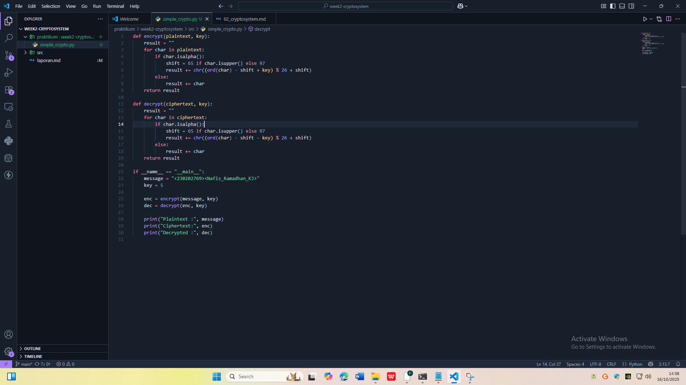
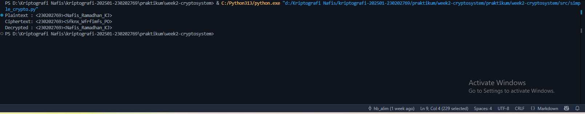

# Laporan Praktikum Kriptografi
Minggu ke-: 2
Topik: Cryptosystem (Komponen, Enkripsi & Dekripsi, Simetris & Asimetris)
Nama: Nafis Ramadhan Khoeru Jati
NIM: 230202769
Kelas: 5IKRB

---

## 1. Tujuan
1. Mengidentifikasi komponen dasar kriptosistem (plaintext, ciphertext, kunci, algoritma).  
2. Menggambarkan proses enkripsi dan dekripsi sederhana.  
3. Mengklasifikasikan jenis kriptosistem (simetris dan asimetris).  

---

## 2. Dasar Teori
Cryptosystem atau sistem kriptografi adalah seperangkat metode atau algoritma yang digunakan untuk mengamankan data melalui proses enkripsi dan dekripsi. Tujuan utama dari sistem ini adalah untuk menjaga kerahasiaan informasi (confidentiality), memastikan integritas data, serta memberikan otentikasi dan non-repudiation. Komponen utama dalam sebuah kriptosistem meliputi plaintext (teks asli), ciphertext (teks yang telah dienkripsi), algoritma enkripsi dan dekripsi, serta kunci (key) yang digunakan dalam proses enkripsi dan dekripsi tersebut.
Enkripsi merupakan proses mengubah data asli (plaintext) menjadi bentuk yang tidak dapat dibaca (ciphertext) tanpa kunci tertentu, sedangkan dekripsi adalah proses mengembalikan ciphertext menjadi bentuk aslinya. Keamanan sistem ini bergantung pada algoritma yang digunakan dan seberapa baik kunci rahasia dijaga. Dalam implementasinya, kriptosistem dibagi menjadi dua jenis utama: kriptografi simetris dan asimetris.
Kriptografi simetris menggunakan satu kunci yang sama untuk proses enkripsi dan dekripsi. Sistem ini lebih cepat dan efisien, sehingga sering digunakan untuk mengamankan data dalam jumlah besar. Namun, kelemahannya terletak pada distribusi kunci — jika kunci jatuh ke tangan yang salah, seluruh sistem bisa terancam. Sebaliknya, kriptografi asimetris menggunakan dua kunci berbeda: kunci publik untuk enkripsi dan kunci privat untuk dekripsi. Sistem ini lebih aman dalam hal distribusi kunci, namun memerlukan lebih banyak sumber daya dan waktu karena prosesnya lebih kompleks.
Dalam praktiknya, kedua jenis sistem ini sering dikombinasikan untuk memanfaatkan kelebihan masing-masing. Sistem asimetris biasanya digunakan untuk pertukaran kunci secara aman, sementara sistem simetris digunakan untuk mengenkripsi isi data secara efisien. Pendekatan hibrida ini umum digunakan dalam berbagai protokol keamanan seperti SSL/TLS pada komunikasi internet.
---

## 3. Alat dan Bahan
- Visual Studio Code / editor lain  
- Git dan akun GitHub  

---

## 4. Langkah Percobaan
1. Membuat file simple_crypto.py di dalam folder praktikum/week2-cryptosystem/src/.
2. Menyalin kode program enkripsi dan dekripsi Caesar Cipher dari panduan praktikum ke dalam file tersebut.
3. Mengganti nilai variabel message dengan format <nim><nama> sesuai identitas pribadi.
4. Menyimpan file dan membuka terminal di direktori file tersebut.
5. Menjalankan program dengan perintah:
6. Mengamati hasil output di terminal, yaitu plaintext, ciphertext hasil enkripsi, dan hasil dekripsi yang sesuai dengan input awal.

---

## 5. Source Code
    def encrypt(plaintext, key):
    result = ""
    for char in plaintext:
        if char.isalpha():
            shift = 65 if char.isupper() else 97
            result += chr((ord(char) - shift + key) % 26 + shift)
        else:
            result += char
    return result

    def decrypt(ciphertext, key):
    result = ""
    for char in ciphertext:
        if char.isalpha():
            shift = 65 if char.isupper() else 97
            result += chr((ord(char) - shift - key) % 26 + shift)
        else:
            result += char
    return result

    if __name__ == "__main__":
    message = "<230202769><Nafis_Ramadhan_KJ>"  
    key = 5

    enc = encrypt(message, key)
    dec = decrypt(enc, key)

    print("Plaintext :", message)
    print("Ciphertext:", enc)
    print("Decrypted :", dec)

---
## 6. Hasil dan Pembahasan
Kriptosistem merupakan fondasi penting dalam menjaga keamanan komunikasi dengan menggunakan proses enkripsi dan dekripsi yang melibatkan plaintext, ciphertext, algoritma, dan kunci. Sistem kriptografi simetris menawarkan kecepatan dan efisiensi, tetapi menghadapi tantangan besar dalam distribusi kunci yang aman. Sementara itu, kriptografi asimetris lebih aman dalam pertukaran kunci karena menggunakan pasangan kunci publik dan privat, meskipun lebih lambat dan kompleks. Oleh karena itu, kombinasi kedua metode ini sering digunakan dalam praktik untuk memanfaatkan kelebihan masing-masing, sehingga komunikasi data dapat terlindungi secara optimal.




)

---

## 7. Jawaban Pertanyaan
Komponen utama dalam sebuah kriptosistem terdiri dari plaintext (data asli), ciphertext (data yang telah dienkripsi), algoritma enkripsi dan dekripsi, serta kunci (key) yang digunakan dalam proses transformasi data. Enkripsi mengubah plaintext menjadi ciphertext menggunakan algoritma dan kunci, sedangkan dekripsi mengembalikan ciphertext menjadi plaintext dengan kunci yang sesuai.
Sistem kriptografi simetris memiliki kelebihan dalam hal kecepatan dan efisiensi karena hanya menggunakan satu kunci untuk proses enkripsi dan dekripsi. Namun, kelemahannya adalah adanya masalah keamanan dalam distribusi kunci, karena kedua pihak harus memiliki kunci yang sama sebelum komunikasi dapat dilakukan. Di sisi lain, sistem asimetris menggunakan sepasang kunci (publik dan privat) yang lebih aman untuk pertukaran informasi, tetapi prosesnya lebih lambat dan membutuhkan sumber daya lebih besar.
Distribusi kunci menjadi masalah utama dalam kriptografi simetris karena kunci yang sama harus dikirim atau dibagikan secara aman kepada pihak lain. Jika proses distribusi ini tidak dilakukan dengan hati-hati, pihak ketiga dapat menyadap atau mencuri kunci tersebut, yang akan mengakibatkan kebocoran data karena kunci tersebut digunakan untuk membuka semua komunikasi yang dilindungi oleh sistem tersebut.

---

## 8. Kesimpulan
Kriptosistem merupakan fondasi penting dalam menjaga keamanan komunikasi dengan menggunakan proses enkripsi dan dekripsi yang melibatkan plaintext, ciphertext, algoritma, dan kunci. Sistem kriptografi simetris menawarkan kecepatan dan efisiensi, tetapi menghadapi tantangan besar dalam distribusi kunci yang aman. Sementara itu, kriptografi asimetris lebih aman dalam pertukaran kunci karena menggunakan pasangan kunci publik dan privat, meskipun lebih lambat dan kompleks. Oleh karena itu, kombinasi kedua metode ini sering digunakan dalam praktik untuk memanfaatkan kelebihan masing-masing, sehingga komunikasi data dapat terlindungi secara optimal.

---

## 9. Daftar Pustaka

---

## 10. Commit Log
(Tuliskan bukti commit Git yang relevan.  
Contoh:
```
commit 
Author: Nafis Ramadhan Khoeru Jati <nafisramadhankhoerujati@gmail.com>
Date:   2025-10-16

    week2-cryptosystem: implementasi Caesar Cipher dan laporan )
```
