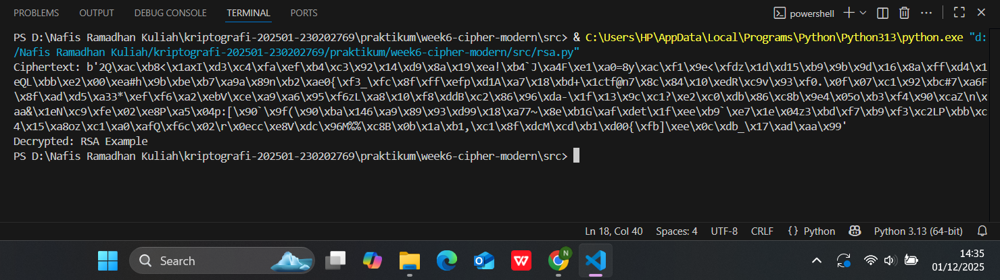
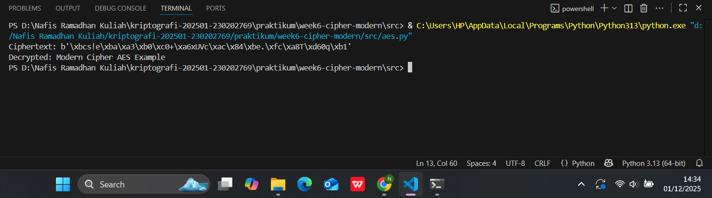
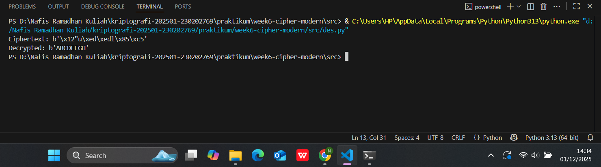

# Laporan Praktikum Kriptografi
Minggu ke-: 6
Topik: Cipher Modern (DES, AES, RSA)
Nama: Nafis Ramadhan Khoeru Jati
NIM: 230202769
Kelas: 230202769

---

## 1. Tujuan
1. Mengimplementasikan algoritma DES untuk blok data sederhana.
2. Menerapkan algoritma AES dengan panjang kunci 128 bit.
3. Menjelaskan proses pembangkitan kunci publik dan privat pada algoritma RSA.
---

## 2. Dasar Teori
Algoritma modern merupakan seperangkat langkah logis dan sistematis yang dirancang untuk memecahkan masalah secara efisien dengan memanfaatkan kemajuan konsep matematis, struktur data, serta teknologi komputasi. Fokus utamanya adalah pada efisiensi waktu dan ruang agar mampu menangani data berskala besar serta berjalan optimal pada sistem paralel dan terdistribusi. Jenis-jenis algoritma modern mencakup algoritma deterministik yang menghasilkan keluaran tetap untuk input yang sama, algoritma non-deterministik yang melibatkan unsur acak, serta algoritma heuristik dan metaheuristik seperti Genetic Algorithm, Simulated Annealing, dan Particle Swarm Optimization yang digunakan untuk menyelesaikan masalah optimisasi kompleks. Dalam bidang kecerdasan buatan, algoritma pembelajaran seperti Neural Network, Decision Tree, dan Q-Learning menjadi dasar utama bagi sistem pembelajaran mesin yang dapat mengenali pola dan membuat prediksi berdasarkan data.

Selain itu, teori algoritma modern juga menekankan pentingnya analisis kompleksitas melalui notasi Big-O untuk mengukur efisiensi suatu algoritma, serta memanfaatkan paradigma pemrograman seperti divide and conquer, dynamic programming, greedy, dan backtracking. Penerapannya meluas ke berbagai bidang, mulai dari kriptografi (seperti RSA dan AES) untuk keamanan data, hingga big data dan komputasi kuantum dengan algoritma seperti MapReduce dan Shor’s Algorithm. Perkembangan terbaru juga mencakup algoritma deep learning dan optimisasi evolusioner yang meniru proses alami untuk menemukan solusi optimal. Dengan demikian, algoritma modern menjadi fondasi utama dalam perkembangan teknologi informasi, kecerdasan buatan, dan sistem komputasi masa kini yang semakin kompleks dan adaptif terhadap kebutuhan zaman.

---

## 3. Alat dan Bahan
- Python 3.x  
- Visual Studio Code / editor lain  
- Git dan akun GitHub  
- Library tambahan pycryptodome

---

## 4. Langkah Percobaan
1. Membuat file `aes.py` `rsa.py` `des.py` di folder `praktikum/week6-cipher-modern/src/`.
2. Menyalin kode program dari panduan praktikum.
3. Menjalankan kode program.

---

## 5. Source Code

AES
```python
from Crypto.Cipher import AES
from Crypto.Random import get_random_bytes

key = get_random_bytes(16)  # 128 bit key
cipher = AES.new(key, AES.MODE_EAX)

plaintext = b"Modern Cipher AES Example"
ciphertext, tag = cipher.encrypt_and_digest(plaintext)

print("Ciphertext:", ciphertext)

# Dekripsi
cipher_dec = AES.new(key, AES.MODE_EAX, nonce=cipher.nonce)
decrypted = cipher_dec.decrypt(ciphertext)
print("Decrypted:", decrypted.decode())
```
RSA

```python
from Crypto.PublicKey import RSA
from Crypto.Cipher import PKCS1_OAEP

# Generate key pair
key = RSA.generate(2048)
private_key = key
public_key = key.publickey()

# Enkripsi dengan public key
cipher_rsa = PKCS1_OAEP.new(public_key)
plaintext = b"RSA Example"
ciphertext = cipher_rsa.encrypt(plaintext)
print("Ciphertext:", ciphertext)

# Dekripsi dengan private key
decipher_rsa = PKCS1_OAEP.new(private_key)
decrypted = decipher_rsa.decrypt(ciphertext)
print("Decrypted:", decrypted.decode())
```
DES
```python
from Crypto.Cipher import DES
from Crypto.Random import get_random_bytes

key = get_random_bytes(8)  # kunci 64 bit (8 byte)
cipher = DES.new(key, DES.MODE_ECB)

plaintext = b"ABCDEFGH"
ciphertext = cipher.encrypt(plaintext)
print("Ciphertext:", ciphertext)

decipher = DES.new(key, DES.MODE_ECB)
decrypted = decipher.decrypt(ciphertext)
print("Decrypted:", decrypted)
```
---

## 6. Hasil dan Pembahasan





---

## 7. Jawaban Pertanyaan
  
- Pertanyaan 1: Perbedaan mendasar antara DES, AES, dan RSA terletak pada jenis algoritma, penggunaan kunci, dan tingkat keamanannya. DES (Data Encryption Standard) merupakan algoritma enkripsi simetris yang menggunakan satu kunci yang sama untuk proses enkripsi dan dekripsi dengan panjang kunci 56-bit. Karena panjang kuncinya pendek, DES kini dianggap tidak aman dan rentan terhadap serangan brute-force. AES (Advanced Encryption Standard) juga merupakan algoritma simetris, tetapi menggunakan panjang kunci yang lebih besar, yaitu 128, 192, atau 256-bit, dengan struktur yang lebih kompleks berbasis substitusi dan permutasi sehingga jauh lebih tahan terhadap serangan modern. Sementara itu, RSA (Rivest–Shamir–Adleman) merupakan algoritma asimetris yang menggunakan dua kunci berbeda, yaitu kunci publik untuk enkripsi dan kunci privat untuk dekripsi, dengan tingkat keamanan yang bergantung pada kesulitan matematis dalam memfaktorkan bilangan prima besar.  
- Pertanyaan 2: AES lebih banyak digunakan karena menawarkan keamanan yang jauh lebih tinggi dan efisiensi yang lebih baik dibanding DES. Kunci 56-bit pada DES kini mudah dipecahkan menggunakan komputer modern dalam hitungan jam atau bahkan menit, sedangkan AES dengan kunci 128-bit atau lebih praktis tidak dapat ditembus dengan brute-force menggunakan teknologi saat ini. Selain itu, AES lebih efisien dalam kecepatan enkripsi dan dekripsi, serta telah menjadi standar internasional (FIPS-197) yang diadopsi oleh pemerintah AS dan banyak organisasi di seluruh dunia. Struktur AES juga dirancang untuk optimal di perangkat keras maupun perangkat lunak, menjadikannya pilihan utama untuk keamanan data di era digital.
- Pertanyaan 3: RSA dikategorikan sebagai algoritma asimetris karena menggunakan dua kunci yang berbeda, yaitu kunci publik yang dapat dibagikan secara bebas dan kunci privat yang harus dijaga kerahasiaannya. Keamanan RSA bergantung pada kesulitan memfaktorkan bilangan besar menjadi faktor prima. Proses pembangkitan kuncinya dimulai dengan memilih dua bilangan prima besar p dan q, menghitung n = p × q, kemudian menentukan nilai φ(n) = (p − 1)(q − 1). Setelah itu dipilih nilai e yang relatif prima terhadap φ(n) sebagai eksponen publik, dan dihitung nilai d sebagai kebalikan e terhadap φ(n), yang menjadi eksponen privat. Dengan demikian, kunci publik terdiri dari (e, n) dan kunci privat dari (d, n). RSA banyak digunakan untuk keamanan komunikasi digital, seperti tanda tangan elektronik, autentikasi, dan enkripsi kunci dalam sistem keamanan modern.  
---

## 8. Kesimpulan
Secara keseluruhan, algoritma modern adalah kumpulan langkah logis yang dirancang untuk memecahkan masalah secara efisien dengan memperhatikan efisiensi waktu dan ruang, serta penerapannya pada sistem komputasi paralel dan terdistribusi. DES, AES, dan RSA merupakan contoh algoritma kriptografi modern yang memiliki perbedaan mendasar dalam jenis kunci dan tingkat keamanannya. DES adalah algoritma simetris dengan kunci tunggal sepanjang 56-bit yang kini dianggap tidak aman, sedangkan AES merupakan penggantinya dengan kunci 128, 192, atau 256-bit yang lebih kuat dan efisien. RSA berbeda karena bersifat asimetris, menggunakan pasangan kunci publik dan privat yang didasarkan pada kesulitan faktorisasi bilangan prima besar. AES lebih banyak digunakan di era modern karena keamanannya yang tinggi dan performanya yang efisien di berbagai platform. Dalam konteks teori algoritma modern, pengembangan metode kriptografi seperti AES dan RSA mencerminkan kemajuan dalam penerapan prinsip algoritmik untuk menjaga keamanan data, efisiensi komputasi, serta kemampuan adaptasi terhadap tantangan teknologi masa kini.

---

## 9. Daftar Pustaka
---

## 10. Commit Log
```
commit week6-cipher-modern
Author: Nafis Ramadhan Khoeru Jati <nafisramadhankhoerujati@gmail.com>
Date:   2025-11-9

    week6-cipher-modern (DES, AES, RSA)
```
