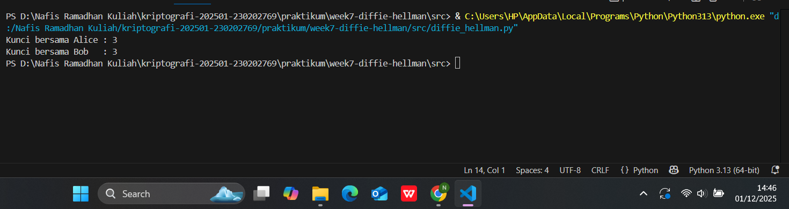

# Laporan Praktikum Kriptografi
Minggu ke-: 7  
Topik: Diffie-Hellman Key Exchange  
Nama: Nafis Ramadhan Khoeru Jati
NIM: 230202769
Kelas: 5IKRB  

---

## 1. Tujuan
1. Melakukan simulasi protokol Diffie-Hellman untuk pertukaran kunci publik.
2. Menjelaskan mekanisme pertukaran kunci rahasia menggunakan bilangan prima dan logaritma diskrit.
3. Menganalisis potensi serangan pada protokol Diffie-Hellman (termasuk serangan Man-in-the-Middle / MITM).

---

## 2. Dasar Teori
Mekanisme Diffie–Hellman adalah sebuah protokol kriptografi yang memungkinkan dua pihak yang belum pernah bertemu sebelumnya untuk membuat kunci rahasia bersama melalui jaringan publik yang tidak aman. Prosesnya dimulai dengan kedua pihak menyepakati sebuah bilangan dasar (g) dan modulus besar (p) yang bersifat publik. Setelah itu, masing-masing pihak memilih kunci privat mereka sendiri, misalnya a dan b, lalu menghitung kunci publik dengan rumus: A = gᵃ mod p dan B = gᵇ mod p. Kedua kunci publik ini dipertukarkan secara terbuka. Namun, karena a dan b dirahasiakan, pihak luar tidak dapat dengan mudah menebaknya. Langkah terakhir, masing-masing pihak menghitung kunci bersama dengan memasukkan kunci publik lawan ke dalam rumus: K = Bᵃ mod p (untuk pihak pertama) dan K = Aᵇ mod p (untuk pihak kedua). Secara matematis, hasilnya sama karena sifat perpangkatan modulo, sehingga keduanya mendapatkan kunci identik tanpa pernah mengirimkannya langsung. Kunci inilah yang kemudian digunakan untuk enkripsi selanjutnya, menjadikan Diffie-Hellman teknik pertukaran kunci yang aman meskipun dilakukan di atas saluran komunikasi yang dapat disadap.

---

## 3. Alat dan Bahan
- Python 3.x  
- Visual Studio Code / editor lain  
- Git dan akun GitHub  

---

## 4. Langkah Percobaan
1. Membuat file `diffie_hellman.py` di folder `praktikum/week7-diffie_hellman/src/`.
2. Menyalin kode program dari panduan praktikum.
3. Menjalankan program dengan perintah `python diffie_hellman.py`.

---

## 5. Source Code

```python
import random

# parameter umum (disepakati publik)
p = 23  # bilangan prima
g = 5   # generator

# private key masing-masing pihak
a = random.randint(1, p-1)  # secret Alice
b = random.randint(1, p-1)  # secret Bob

# public key
A = pow(g, a, p)
B = pow(g, b, p)

# exchange public key
shared_secret_A = pow(B, a, p)
shared_secret_B = pow(A, b, p)

print("Kunci bersama Alice :", shared_secret_A)
print("Kunci bersama Bob   :", shared_secret_B)
```

---

## 6. Hasil dan Pembahasan
Percobaan Diffie–Hellman dengan parameter kecil (p = 23) dan (g = 5) menunjukkan bahwa Alice dan Bob berhasil menghasilkan kunci bersama yang sama, sehingga mekanisme dasar pertukaran kunci bekerja dengan benar; namun dari sisi keamanan, konfigurasi ini sangat lemah karena kunci privat dapat ditebak melalui brute-force atau tabel eksponen sederhana, dan tidak adanya autentikasi membuat protokol rentan terhadap serangan Man-in-the-Middle (MITM). Secara keseluruhan, percobaan berhasil mendemonstrasikan konsep Diffie–Hellman, tetapi tidak aman untuk digunakan di dunia nyata tanpa modulus besar atau ECDH, autentikasi, serta praktik kriptografi yang sesuai standar modern. 

Hasil eksekusi program Diffie Hellman:



---

## 7. Jawaban Pertanyaan  
- Pertanyaan 1: Diffie-Hellman memungkinkan pertukaran kunci di saluran publik karena keamanan protokol ini bergantung pada Discrete Logarithm Problem yang sangat sulit dipecahkan. Walaupun nilai-nilai seperti ( g ), ( p ), dan hasil komputasi ( g^a \mod p ) serta ( g^b \mod p ) dapat dilihat oleh siapa saja, penyerang tetap tidak dapat menemukan nilai kunci rahasia bersama tanpa mengetahui nilai privat ( a ) atau ( b ). Dengan kata lain, yang dipublikasikan hanyalah nilai-nilai “antara” yang tidak cukup untuk membalik proses matematisnya.  
- Pertanyaan 2: Kelemahan utama Diffie-Hellman murni adalah tidak adanya autentikasi, sehingga protokol tidak dapat memastikan bahwa lawan komunikasi benar-benar pihak yang seharusnya. Hal ini membuat protokol ini mudah disusupi oleh penyerang yang menyamar sebagai salah satu pihak dan melakukan Man-in-the-Middle. Selain itu, jika parameter ( p ) dan ( g ) dipilih secara lemah atau tidak divalidasi, keamanan keseluruhan protokol dapat menurun.
- Pertanyaan 3: Untuk mencegah Man-in-the-Middle, protokol Diffie-Hellman harus digabungkan dengan mekanisme autentikasi seperti tanda tangan digital, sertifikat digital berbasis PKI, atau metode verifikasi identitas lainnya. Dengan autentikasi, setiap pihak dapat memeriksa bahwa nilai yang diterimanya benar-benar berasal dari lawan komunikasi yang sah, bukan dari penyerang. Implementasi modern seperti TLS menggunakan Authenticated Diffie-Hellman (misalnya DHE atau ECDHE) untuk memastikan kerahasiaan sekaligus keaslian pertukaran kunci.  

---

## 8. Kesimpulan
Berdasarkan uraian dan percobaan Diffie–Hellman, dapat disimpulkan bahwa protokol ini memungkinkan dua pihak membangun kunci rahasia bersama melalui saluran publik karena hanya nilai-nilai antara yang dipertukarkan, sementara kunci privat tetap tersembunyi dan sulit dihitung kembali akibat kemampuan matematis Discrete Logarithm Problem. Meskipun konsep dasarnya bekerja dengan baik, protokol Diffie–Hellman murni memiliki kelemahan penting, yaitu tidak adanya autentikasi, sehingga rentan terhadap serangan Man-in-the-Middle, terutama jika parameter yang digunakan kecil atau lemah. Percobaan sederhana dengan p = 23 dan g = 5 menunjukkan bahwa mekanisme pembentukan kunci bersama dapat berfungsi, tetapi konfigurasi ini tidak aman untuk praktik nyata karena mudah ditebak dan tidak memenuhi standar kriptografi modern. Dengan demikian, penggunaan Diffie–Hellman yang aman membutuhkan modulus besar atau ECDH serta integrasi autentikasi seperti tanda tangan digital atau sertifikat PKI agar komunikasi terlindungi dan tidak dapat disusupi pihak ketiga.

---

## 9. Daftar Pustaka
---

## 10. Commit Log
```
week7-diffie-hellman
Author: Nafis Ramadhan Khoeru Jati <nafisramadhankhoerujati@gmail.com>
Date:   2025-11-18

    wweek7-diffie-hellman Key Change
```
